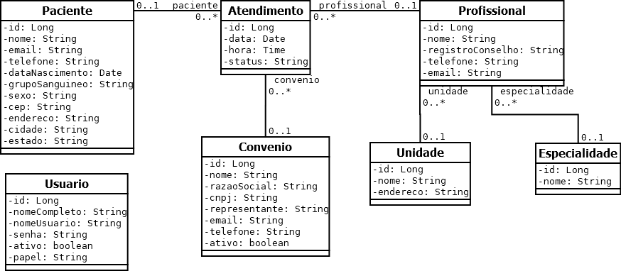
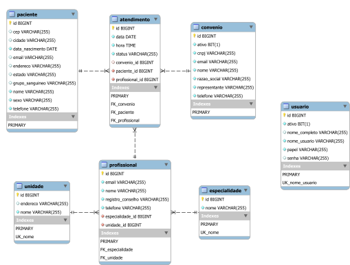

# integracao-continua
Repositório da disciplina Integração Contínua

# Como inciar a aplicação

## Back-end
```
cd back-end
mvn package
java -jar target\sgcmapi.jar
```
Ou
```
cd back-end
mvn spring-boot:run
```
A aplicação vai iniciar no endereço https://localhost:9000, com acesso local a base de dados MySQL, por meio da porta padrão 3306, além de usuário e senha "root".

## Front-end
Para iniciar a aplicação, é necessário também instalar as dependências do projeto.
```
cd front-end
npm install
ng serve --ssl
```
A aplicação vai iniciar no endereço https://localhost:4200.

# Sites de referência

- Software Delivery Guide (Martin Fowler): https://martinfowler.com/delivery.html
- GitHub Docs - GitHub Actions: https://docs.github.com/pt/actions

# Ferramentas

- **Railway**
  - Plataforma que será utilizada para deploy da aplicação back-end.
  - Criar uma conta: https://railway.app/
  - Outras alternativas: https://github.com/Engagespot/heroku-free-alternatives
- **Visual Studio Code**
  - https://code.visualstudio.com/Download
- **Extension Pack for Java (Extensão do VS Code)**
  - https://marketplace.visualstudio.com/items?itemName=vscjava.vscode-java-pack
- **Spring Boot Extension Pack (Extensão do VS Code)**
  - https://marketplace.visualstudio.com/items?itemName=pivotal.vscode-boot-dev-pack
- **Thunder Client (Extensão do VS Code)**
  - https://marketplace.visualstudio.com/items?itemName=rangav.vscode-thunder-client
- **XML (Extensão do VS Code)**
  - https://marketplace.visualstudio.com/items?itemName=redhat.vscode-xml
- **Angular Language Service (Extensão do VS Code)**
  - https://marketplace.visualstudio.com/items?itemName=vscjava.vscode-java-pack
- **Git**
  - https://git-scm.com/downloads
- **JDK 11**
  - Para verificar se o JDK está corretamente instalado e configurado, digite no prompt de comandos:
    - ```javac -version```
  - Se necessário, realizar a instalação e configuração:
    - Link para download: https://www.oracle.com/br/java/technologies/javase/jdk11-archive-downloads.html
    - Criar a variável de ambiente JAVA_HOME configurada para o diretório de instalação do JDK. Exemplo: “C:\Program Files\Java\jdk-11.0.13”.
    - Adicionar “%JAVA_HOME% bin” na variável de ambiente PATH.
    - Tutorial de configuração: https://mkyong.com/java/how-to-set-java_home-on-windows-10/
- **Maven**
  - Para verificar se o Maven está corretamente instalado e configurado, digite no prompt de comandos:
    - ```mvn -version```
  - Se necessário, realizar a instalação e configuração:
    - Link para download: https://dlcdn.apache.org/maven/maven-3/3.8.6/binaries/apache-maven-3.8.6-bin.zip
    - Adicionar o diretório de instalação do Maven na variável de ambiente PATH. Exemplo: “C:\apache-maven\bin”.
    - Tutorial de instalação: https://mkyong.com/maven/how-to-install-maven-in-windows/
- **MySQL**
  - Verificar se o MySQL está funcionando:
    - Tutorial para resetar a senha de root, caso necessário: https://dev.mysql.com/doc/mysql-windows-excerpt/8.0/en/resetting-permissions-windows.html
    - Tentar acessar com senha em branco ou senha igual ao nome de usuário (root).
    - Para tentar conectar no MySQL, no prompt de comandos digite:
      - ```mysql -u root -p```
  - Remova o banco de dados ```sgcm```, se existir:
    - No prompt de comandos digite:
      - ```mysql -u root -p```
    - Ao conectar no MySQL, execute a seguinte instrução SQL:
      - ```DROP DATABASE sgcm;```
  - Se necessário, realizar a instalação:
    - Link para download: https://dev.mysql.com/downloads/file/?id=512698
    - [Tutorial de instalação](https://github.com/webacademyufac/frameworks-back-end/blob/main/tutoriais/mysql/mysql.md)
- **Node.js (e npm)**
  - Versão 14.15 ou superior.
  - Para verificar a versão do Node.js, no prompt de comandos digite:
    - ```node --version```
  - Link para download (escolha a versão LTS): https://nodejs.org/en/download/
- **Angular CLI:**
  - Versão 14.0 ou superior.
  - Para verificar a versão do Angular CLI, no prompt de comandos digite:
    - ```ng --version``` ou ```ng version```
  - Tutorial de instalação: https://angular.io/guide/setup-local
  - Para instalar o Angular CLI, no prompt de comandos digite:
    - ```npm install -g @angular/cli```

# SGCM - Diagrama de Classes



# SGCM - Diagrama Entidade Relacionamento



# Atividade prática

1. Modificar workflow para que o ***job*** que compila o projeto do back-end, realiza os testes e cria o arquivo JAR, seja dividido em dois ***jobs***, sendo um para teste e outro para criar o arquivo JAR.

    - Comando para executar os testes: ```mvn --activate-profiles prod test```
    - Comando para criar o arquivo JAR (sem testes): ```mvn --activate-profiles prod -DskipTests package```

2. Criar um workflow para integração e implantação contínua para o projeto front-end utilizando o GitHub Actions.

    - A implantação pode ser feita em qualquer plataforma.
    - Comando para executar os testes: ```npm test -- --no-watch --no-progress --browsers=ChromeHeadlessCI```
    - Comando para compilar o projeto: ```npm run build --prod```
    - IMPORTANTE:
      - Configurar a constante ```API_URL``` no arquivo ```environment.prod.ts``` do projeto front-end.
      - Modificar as configurações de CORS no back-end para adicionar o host da aplicação front-end em produção.
